# Class Diagram

This document contains a simple UML-style class diagram for the Mini Notification Gateway project.

The diagram focuses on the main classes, interfaces, and design patterns used in the project.

```mermaid
classDiagram

class Program {
    +Main()
}

class ServiceCollectionExtensions {
    +AddMiniNotificationGateway(IServiceCollection) IServiceCollection
}

class Message {
    +Guid MessageId
    +string Recipient
    +string Content
    +DateTime CreatedAt
    +MessageStatus Status
    +string CurrentStateName
    +MarkAsSending()
    +MarkAsSent()
    +MarkAsFailed()
}

class MessageStatus {
    <<enumeration>>
    Created
    Sending
    Sent
    Failed
}

class IMessageState {
    <<interface>>
    +string Name
    +MarkAsSending(Message)
    +MarkAsSent(Message)
    +MarkAsFailed(Message)
}

class CreatedMessageState
class SendingMessageState
class SentMessageState
class FailedMessageState

IMessageState <|.. CreatedMessageState
IMessageState <|.. SendingMessageState
IMessageState <|.. SentMessageState
IMessageState <|.. FailedMessageState
Message --> IMessageState
Message --> MessageStatus

class IMessageFactory {
    <<interface>>
    +Create(string) Message
}

class OtpMessageFactory {
    +Create(string) Message
}

class IOtpCodeGenerator {
    <<interface>>
    +Generate() string
}

class SixDigitOtpCodeGenerator {
    +Generate() string
}

IMessageFactory <|.. OtpMessageFactory
IOtpCodeGenerator <|.. SixDigitOtpCodeGenerator
OtpMessageFactory --> IOtpCodeGenerator
OtpMessageFactory --> Message

class INotificationProvider {
    <<interface>>
    +ProviderName Name
    +SendAsync(Message) Task~SendResult~
}

class ProviderAClient {
    +SendSmsAsync(string, string) Task~bool~
}

class ProviderBClient {
    +DeliverAsync(ProviderBRequest) Task~ProviderBResponse~
}

class ProviderAAdapter {
    +ProviderName Name
    +SendAsync(Message) Task~SendResult~
}

class ProviderBAdapter {
    +ProviderName Name
    +SendAsync(Message) Task~SendResult~
}

INotificationProvider <|.. ProviderAAdapter
INotificationProvider <|.. ProviderBAdapter
ProviderAAdapter --> ProviderAClient
ProviderBAdapter --> ProviderBClient
ProviderAAdapter --> SendResult
ProviderBAdapter --> SendResult

class SendResult {
    +bool IsSuccess
    +ProviderName ProviderName
    +string Description
    +Success(ProviderName, string) SendResult
    +Failure(ProviderName, string) SendResult
}

class ProviderName {
    <<enumeration>>
    ProviderA
    ProviderB
}

SendResult --> ProviderName
INotificationProvider --> ProviderName

class INotificationProviderHandler {
    <<interface>>
    +SetNext(INotificationProviderHandler) INotificationProviderHandler
    +HandleAsync(Message) Task~SendResult~
}

class NotificationProviderHandler {
    +SetNext(INotificationProviderHandler) INotificationProviderHandler
    +HandleAsync(Message) Task~SendResult~
}

INotificationProviderHandler <|.. NotificationProviderHandler
NotificationProviderHandler --> INotificationProvider
NotificationProviderHandler --> INotificationProviderHandler
NotificationProviderHandler --> INotificationEventPublisher

class ISendingStrategy {
    <<interface>>
    +SendAsync(Message) Task~SendResult~
}

class FailoverSendingStrategy {
    +SendAsync(Message) Task~SendResult~
}

ISendingStrategy <|.. FailoverSendingStrategy
FailoverSendingStrategy --> INotificationProviderHandler

class ICommand~TResult~ {
    <<interface>>
    +ExecuteAsync() Task~TResult~
}

class ICommandInvoker {
    <<interface>>
    +InvokeAsync(ICommand) Task~TResult~
}

class CommandInvoker {
    +InvokeAsync(ICommand) Task~TResult~
}

class SendOtpCommand {
    +ExecuteAsync() Task~SendResult~
}

ICommandInvoker <|.. CommandInvoker
ICommand <|.. SendOtpCommand
SendOtpCommand --> Message
SendOtpCommand --> ISendingStrategy

class INotificationGatewayFacade {
    <<interface>>
    +SendOtpAsync(string) Task~OtpSendResponse~
}

class NotificationGatewayFacade {
    +SendOtpAsync(string) Task~OtpSendResponse~
}

class LoggingNotificationGatewayFacadeDecorator {
    +SendOtpAsync(string) Task~OtpSendResponse~
}

class RateLimitedNotificationGatewayFacadeProxy {
    +SendOtpAsync(string) Task~OtpSendResponse~
}

INotificationGatewayFacade <|.. NotificationGatewayFacade
INotificationGatewayFacade <|.. LoggingNotificationGatewayFacadeDecorator
INotificationGatewayFacade <|.. RateLimitedNotificationGatewayFacadeProxy

NotificationGatewayFacade --> IMessageFactory
NotificationGatewayFacade --> ISendingStrategy
NotificationGatewayFacade --> ICommandInvoker
NotificationGatewayFacade --> INotificationEventPublisher
NotificationGatewayFacade --> OtpSendResponse

LoggingNotificationGatewayFacadeDecorator --> INotificationGatewayFacade
RateLimitedNotificationGatewayFacadeProxy --> INotificationGatewayFacade

class OtpSendResponse {
    +Message Message
    +SendResult SendResult
}

OtpSendResponse --> Message
OtpSendResponse --> SendResult

class INotificationEventPublisher {
    <<interface>>
    +Subscribe(IEventObserver)
    +PublishAsync(NotificationEvent)
}

class NotificationEventPublisher {
    +Subscribe(IEventObserver)
    +PublishAsync(NotificationEvent)
}

class IEventObserver {
    <<interface>>
    +OnEventAsync(NotificationEvent)
}

class InMemoryEventObserver {
    +Events IReadOnlyCollection~NotificationEvent~
    +OnEventAsync(NotificationEvent)
}

class ConsoleEventObserver {
    +OnEventAsync(NotificationEvent)
}

class NotificationEvent {
    +Guid EventId
    +NotificationEventType EventType
    +Guid MessageId
    +string Description
    +DateTime OccurredAt
}

class NotificationEventType {
    <<enumeration>>
    MessageCreated
    ProviderSelected
    MessageSent
    MessageFailed
    ProviderChanged
}

INotificationEventPublisher <|.. NotificationEventPublisher
IEventObserver <|.. InMemoryEventObserver
IEventObserver <|.. ConsoleEventObserver
NotificationEventPublisher --> IEventObserver
NotificationEventPublisher --> NotificationEvent
NotificationEvent --> NotificationEventType

class DemoOutputWriter {
    +Write(OtpSendResponse, IReadOnlyCollection~NotificationEvent~)
}

DemoOutputWriter --> OtpSendResponse
DemoOutputWriter --> NotificationEvent

Program --> ServiceCollectionExtensions
Program --> INotificationGatewayFacade
Program --> InMemoryEventObserver
Program --> DemoOutputWriter
```

## Pattern Map

| Design Pattern | Main Classes |
|---|---|
| Factory Method | `IMessageFactory`, `OtpMessageFactory` |
| Adapter | `ProviderAAdapter`, `ProviderBAdapter` |
| Chain of Responsibility | `INotificationProviderHandler`, `NotificationProviderHandler` |
| State | `IMessageState`, `CreatedMessageState`, `SendingMessageState`, `SentMessageState`, `FailedMessageState` |
| Observer | `INotificationEventPublisher`, `NotificationEventPublisher`, `IEventObserver`, `InMemoryEventObserver`, `ConsoleEventObserver` |
| Command | `ICommand`, `SendOtpCommand`, `ICommandInvoker`, `CommandInvoker` |
| Strategy | `ISendingStrategy`, `FailoverSendingStrategy` |
| Facade | `INotificationGatewayFacade`, `NotificationGatewayFacade` |
| Decorator | `LoggingNotificationGatewayFacadeDecorator` |
| Proxy | `RateLimitedNotificationGatewayFacadeProxy` |